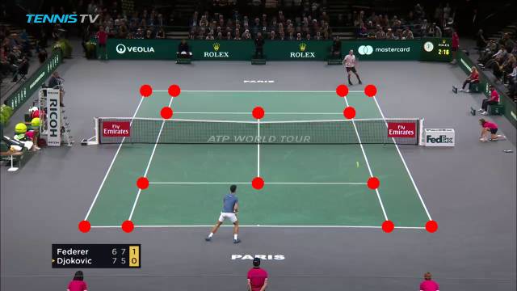
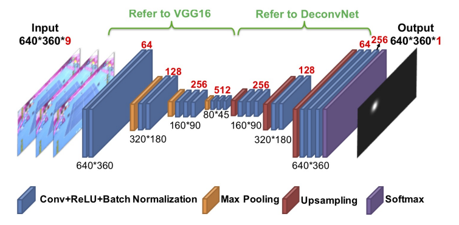
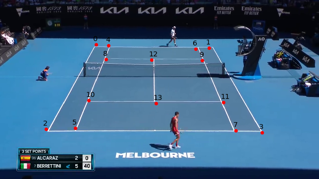
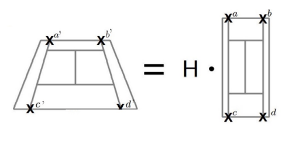
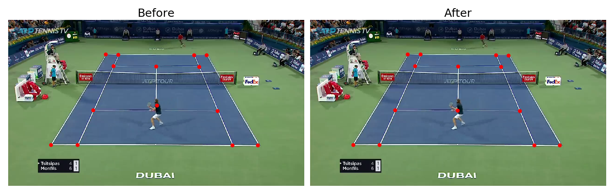

# TennisCourtDetector
Deep learning network for detecting tennis court

It was developed a deep learning network to detect tennis court keypoints from broadcast videos. The proposed heatmap-based deep learning
network allows to detect 14 points of tennis court. Postprocessing techniques (based on classical computer vision methods) were implemented to enhance 
net predictions.

## Dataset
The dataset consists of 8841 images, which were separeted to train set (75%) and validation set (25%). Each image has 14 annotated points. 
The resolution of images is 1280×720. This dataset contains all court types (hard, clay, grass). Click the link 
https://drive.google.com/file/d/1lhAaeQCmk2y440PmagA0KmIVBIysVMwu/view?usp=drive_link to download the dataset

### Dataset collection
This dataset was created in semi-automated way. Video highlights from different tournaments with length from 2 to 3 minutes were downloaded from YouTube. 
Frames from video were extracted with step 50 frames to run them through classical computer vision algorithm. The quality of existing computer vision 
algorithm is not good therefore the resulting images were filtered manually.    

## Model architecture
Proposed deep learning network is very similar to TrackNet architecture. 
 
  The difference is that input tensor consists of just 1 image (instead of 3 in TrackNet) and output tensor has 15 channels (14 from dataset and one additional
point is center of tennis court). We used additional point for better convergence. The resolution of input and output image is 640x360.

## Postporcessing
It was implemented 2 types of postprocessing techniques:
### 1. Refine keypoints using classical computer vision
Lets apply our intermediate model to one image  
  
If we zoom, for example the fifth point, we can see that prediction is not perfect.  
   
To overcome this issue we will exctract white pixels from crop, detect lines and get intersection of these lines by using classical computer vision techniques. 

### 2. Use homography to reconstruct shifted keypointes.
  
The main thing is that we can compare predicted points with reference ones by using homography matrix. To detect homography matrix we use 4 predicted points
and 4 points from reference court. Resulting matrix gives us one-to-one correspondense and we can move predicted point to the right position using reference
points location. It can be helpful, for example, in case of occlusion.
  

## Evaluation (metrics)
We will assume that keypoint is accurately detected if the Euclidean distance between the model prediction and the ground truth is less than 7 pixels.
Based on this assumption we can calculate true positive and false positive rates. The overall performance in terms of precision, accuracy and median 
distance between predicted point and ground truth you can see in the table below. We will also show how postprocessing techniques affect 
the final metrics.

|                                | Precision | Accuracy | Median dist |
| -----------                    | --------- | -------  |  ------     | 
| Base model (BM)                | 0.936     | 0.933    | 2.83        |
| BM + refining kps              | 0.939     | 0.936    | 2.23        |
| BM + homography                | 0.961     | 0.959    | 2.27        |  
| BM + refining kps + homography | 0.963     | 0.961    | 1.83        | 

## Pretrained model
You can check these weights https://drive.google.com/file/d/1f-Co64ehgq4uddcQm1aFBDtbnyZhQvgG/view?usp=drive_link to try model

## How to train
1. Clone the repository `https://github.com/yastrebksv/TennisCourtDetector.git`
2. Run `pip install -r requirements.txt` to install packages required
3. Put dataset into `/data` folder
4. Run `python main.py` to start training

## Infer in video 
 
